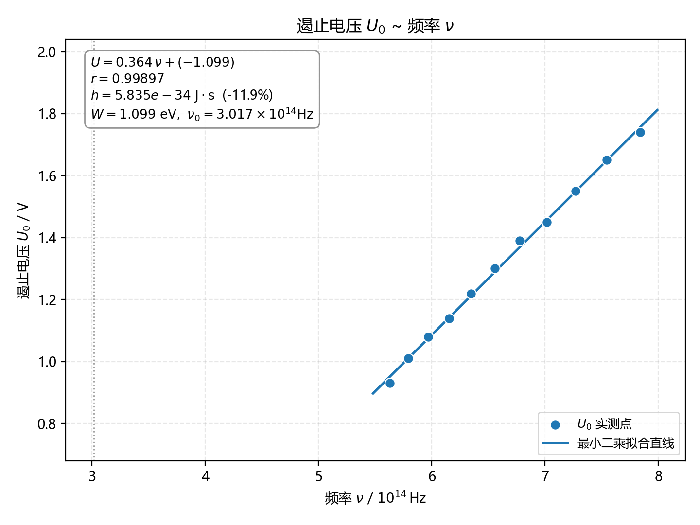
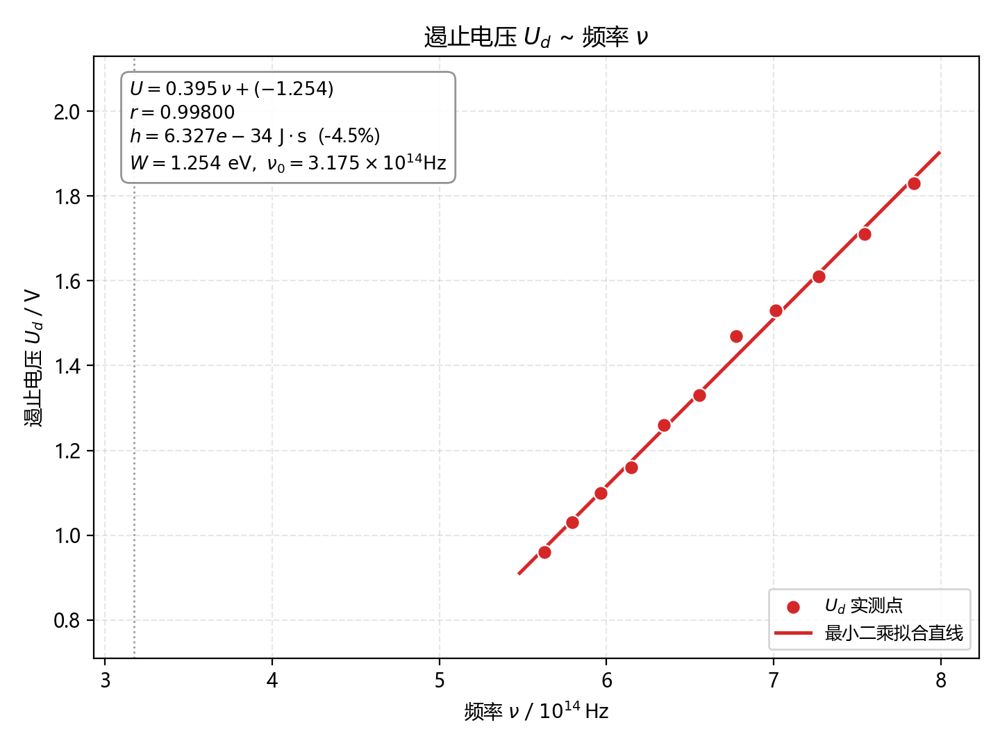
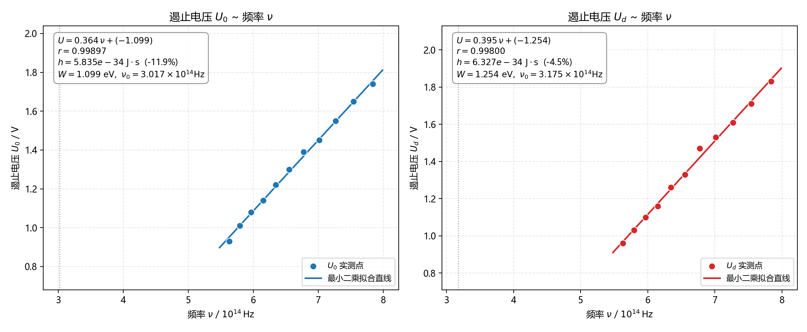

# 实验四十二　利用光电效应测量普朗克常数

> 本文件为实验报告中 **[数据记录与分析]** 与 **[思考题]** 两部分内容。
> 原始数据见 `data.xlsx`；作图与拟合由 `photoelectric_analysis.py` 完成，图片为 `fig1_U0_vs_nu.png`、`fig2_Ud_vs_nu.png`、`fig3_U0_Ud_对比.png`。
> 常数取 $c=2.997\,924\,58\times10^{8}\ \mathrm{m/s}$，$e=1.602\,176\,634\times10^{-19}\ \mathrm{C}$，公认值 $h_0=6.626\,070\,15\times10^{-34}\ \mathrm{J\cdot s}$。
> 波长零点校准：单色仪测微鼓轮 $0.01\ \mathrm{mm}$ 对应 $1\ \mathrm{nm}$，测得零点读数 $l_0=0.376\ \mathrm{mm}$，故**波长校准值 $\Delta\lambda=37.6\ \mathrm{nm}$，校准后波长 $\lambda_c=\lambda-\Delta\lambda$**。
> 电压表最大允许误差取 $\Delta=0.01\ \mathrm{V}$，按均匀分布取 B 类不确定度 $u_B=\dfrac{0.01}{\sqrt{3}}\approx0.0058\ \mathrm{V}$。

---

## [数据记录与分析]

### 1. 波长读数校准值

单色仪螺旋测微器的位移量与输出波长成正比：测微螺杆位移一个分度（$0.01\ \mathrm{mm}$）对应输出波长变化 $1\ \mathrm{nm}$。

| 项目 | 数值 |
|:--|:--:|
| 零点读数 $l_0$ | $0.376\ \mathrm{mm}$ |
| 波长校准值 $\Delta\lambda=l_0\times100$ | $37.6\ \mathrm{nm}$ |

实测波长读数 $\lambda$ 偏大 $37.6\ \mathrm{nm}$，故校准后波长为

$$\lambda_c=\lambda-\Delta\lambda=\lambda-37.6\ \mathrm{nm}$$

### 2. 暗电流

暗电流—电压的对应数据本实验未逐点记录（略）。测截止电压时以无光照条件下的电流读数作为暗电流本底，数据处理中按本底扣除，其来源与抑制方法见 [思考题 2](#2-暗电流的来源是什么如何通过实验操作减小其影响)。

### 3. 截止电压测量数据

波长 $\lambda$ 为单色仪读数，单位 $\mathrm{nm}$；$\lambda_c$ 为校准后波长，单位 $\mathrm{nm}$；频率 $\nu$ 单位 $10^{14}\ \mathrm{Hz}$；电压单位 $\mathrm{V}$；电流单位 $10^{-13}\ \mathrm{A}$。-$U_0$、-$U_d$ 为两种判据（光电流为零法、交点法）读出的遏止电压。

**表 1　截止电压及相关数据**

| $\lambda/\mathrm{nm}$ | 420 | 435 | 450 | 465 | 480 | 495 | 510 | 525 | 540 | 555 | 570 |
|:--|--:|--:|--:|--:|--:|--:|--:|--:|--:|--:|--:|
| $\lambda_c/\mathrm{nm}$ | 382.4 | 397.4 | 412.4 | 427.4 | 442.4 | 457.4 | 472.4 | 487.4 | 502.4 | 517.4 | 532.4 |
| $\nu/10^{14}\mathrm{Hz}$ | 7.840 | 7.544 | 7.269 | 7.014 | 6.777 | 6.554 | 6.346 | 6.151 | 5.967 | 5.794 | 5.631 |
| $-U_0/\mathrm{V}$ | 1.74 | 1.65 | 1.55 | 1.45 | 1.39 | 1.30 | 1.22 | 1.14 | 1.08 | 1.01 | 0.93 |
| $I_d/10^{-13}\mathrm{A}$ | -1.60 | -1.50 | -1.50 | -1.60 | -1.50 | -1.50 | -1.60 | -1.40 | -1.60 | -1.60 | -1.60 |
| $-U_d/\mathrm{V}$ | 1.83 | 1.71 | 1.61 | 1.53 | 1.47 | 1.33 | 1.26 | 1.16 | 1.10 | 1.03 | 0.96 |

> 注：$U_0$ 读数与对应的暗电流 $I_d$ 应满足同一组电压—暗电流对应关系；$U_d$ 由实测伏安曲线直线段与反向电流曲线段的交点确定。

### 4. 作图与最小二乘线性拟合

由爱因斯坦光电方程 $h\nu=\frac12mv^2_{\max}+W=eU+W$，可得

$$U=\frac{h}{e}\,\nu-\frac{W}{e}=k\nu+d$$

即遏止电压与频率成线性关系，**斜率 $k=h/e$，截距 $d=-W/e$**。

以 $\nu$ 为横坐标、$U$ 为纵坐标作散点图并作最小二乘直线拟合，如图 1、图 2（对比图见图 3）。

> **图 1　$U_0$—$\nu$ 散点图及最小二乘拟合直线**（$\nu$ 单位 $10^{14}\ \mathrm{Hz}$）

> **图 2　$U_d$—$\nu$ 散点图及最小二乘拟合直线**（$\nu$ 单位 $10^{14}\ \mathrm{Hz}$）

> **图 3　两种判据 $U_0$—$\nu$ 与 $U_d$—$\nu$ 拟合结果对比**

**表 2　最小二乘线性拟合结果**

| 判据 | 拟合直线（$\nu$ 单位 $10^{14}\mathrm{Hz}$） | 相关系数 $r$ | 斜率 $k/\mathrm{V\cdot s}$ | 截距 $d/\mathrm{V}$ |
|:--|:--|:--:|:--:|:--:|
| $U_0$—$\nu$ | $U_0=0.364\,2\,\nu-1.098\,8$ | 0.998 97 | $3.642\times10^{-15}$ | $-1.098\,8$ |
| $U_d$—$\nu$ | $U_d=0.394\,9\,\nu-1.253\,9$ | 0.998 00 | $3.949\times10^{-15}$ | $-1.253\,9$ |

由 $k=h/e$ 得**普朗克常数**

$$h=e\,k$$

| 判据 | $h=e\,k\ /\ \mathrm{J\cdot s}$ | 与公认值比较 |
|:--|:--:|:--:|
| $U_0$—$\nu$ | $5.835\times10^{-34}$ | $-11.9\%$ |
| $U_d$—$\nu$ | $6.327\times10^{-34}$ | $-4.5\%$ |
| **两种判据平均** | $\mathbf{6.081\times10^{-34}}$ | $\mathbf{-8.2\%}$ |

由截距 $d=-W/e$ 得**逸出功** $W=-e\,d$，由 $h\nu_0=W$ 得**红限频率** $\nu_0=-d/k$ 及**红限波长** $\lambda_0=c/\nu_0$：

| 判据 | 逸出功 $W=-d/\mathrm{eV}$ | 红限频率 $\nu_0/10^{14}\mathrm{Hz}$ | 红限波长 $\lambda_0/\mathrm{nm}$ |
|:--|:--:|:--:|:--:|
| $U_0$—$\nu$ | 1.099 | 3.017 | 993.7 |
| $U_d$—$\nu$ | 1.254 | 3.175 | 944.1 |
| **平均** | **1.176** | **3.096** | **968.3** |

### 5. 不确定度分析

**(a) 电压的 B 类不确定度**

电压表最大允许误差 $\Delta=0.01\ \mathrm{V}$，按均匀分布

$$u_B(U)=\frac{\Delta}{\sqrt{3}}=\frac{0.01}{1.732}=0.0058\ \mathrm{V}$$

**(b) 拟合斜率的不确定度**

记 $S_{xx}=\sum(\nu_i-\bar\nu)^2$，剩余标准差 $s=\sqrt{\dfrac{\sum(U_i-\hat U_i)^2}{n-2}}$，则

$$u_A(k)=\frac{s}{\sqrt{S_{xx}}},\qquad u_B(k)=\frac{u_B(U)}{\sqrt{S_{xx}}},\qquad u(k)=\sqrt{u_A^2(k)+u_B^2(k)}$$

**表 3　斜率不确定度**

| 判据 | $n$ | 剩余标准差 $s/\mathrm{V}$ | $u_A(k)$ | $u_B(k)$ | $u(k)$ | $u(k)/k$ |
|:--|:--:|:--:|:--:|:--:|:--:|:--:|
| $U_0$—$\nu$ | 11 | 0.012 7 | $5.50\times10^{-3}$ | $2.50\times10^{-3}$ | $6.05\times10^{-3}$ | 1.7 % |
| $U_d$—$\nu$ | 11 | 0.019 2 | $8.34\times10^{-3}$ | $2.50\times10^{-3}$ | $8.70\times10^{-3}$ | 2.2 % |

可见 **A 类（读数散布）大于 B 类（仪器误差）**，是斜率不确定度的主要来源。

**(c) $h$、$W$、$\nu_0$ 的不确定度**

由 $h=ek$ 得 $u(h)=e\,u(k)$；由 $W=-ed$ 得 $u(W)=e\,u(d)$；由 $\nu_0=-d/k$ 得 $\dfrac{u(\nu_0)}{\nu_0}=\sqrt{\left(\dfrac{u_d}{d}\right)^2+\left(\dfrac{u_k}{k}\right)^2}$。

| 判据 | $h=(ek)\ /\ \mathrm{J\cdot s}$ | $W/\mathrm{eV}$ | $\nu_0/10^{14}\mathrm{Hz}$ |
|:--|:--:|:--:|:--:|
| $U_0$—$\nu$ | $(5.84\pm0.10)\times10^{-34}$ | $1.099\pm0.040$ | $3.02\pm0.12$ |
| $U_d$—$\nu$ | $(6.33\pm0.14)\times10^{-34}$ | $1.254\pm0.058$ | $3.18\pm0.16$ |

两种判据各自的不确定度虽只有 $1.7\%$、$2.2\%$，但两者结果相差 $0.49\times10^{-34}\ \mathrm{J\cdot s}$（约 $8\%$），**远大于单次拟合的不确定度**，说明存在与判读方法有关的系统误差。故取两种判据的平均，并以两值的样本标准偏差 $u=\dfrac{|h_1-h_2|}{\sqrt{2}}=0.35\times10^{-34}\ \mathrm{J\cdot s}$ 估计总不确定度：

> **测量结果**
>
> $$h=(6.08\pm0.35)\times10^{-34}\ \mathrm{J\cdot s}\quad(\text{相对不确定度约 }5.7\%)$$
> $$W=1.18\pm0.08\ \mathrm{eV},\qquad \nu_0=(3.10\pm0.08)\times10^{14}\ \mathrm{Hz},\qquad \lambda_0\approx968\ \mathrm{nm}$$

### 6. 讨论

1. **线性关系成立**：$U$—$\nu$ 直线相关系数均优于 0.998，$U$ 与 $\nu$ 呈良好线性，定量验证了爱因斯坦光电方程 $h\nu=eU+W$，也说明光电子最大初动能与频率成正比、与光强无关。
2. **两种判据的差异**：$U_d$（交点法）比 $U_0$（光电流为零法）系统偏大 $0.05\sim0.09\ \mathrm{V}$。原因是实测伏安曲线的"光电流为零点"受**阳极反向电流**影响而外移，交点法可部分扣除该影响，故 $U_d$ 更接近真实遏止电压，其拟合所得 $h$ 的偏差（$-4.5\%$）也小于 $U_0$（$-11.9\%$）。
3. **主要误差来源**：
   - **阳极反向光电流**（见思考题 1）——使遏止电压偏大、直线平移，是 $h$ 偏低的系统性因素之一；
   - **暗电流**（见思考题 2）——抬高"零电流点"，使读出的 $|U|$ 偏大；
   - **单色仪波长零点误差**：$\Delta\lambda=37.6\ \mathrm{nm}$ 从读数中扣除后，$\lambda_c$ 仍有约 $1\ \mathrm{nm}$ 的残余误差，引起 $\nu$ 的相对误差约 $0.3\%$，对斜率影响约 $1\%$；
   - **接触电势差**：阴极与阳极材料不同引起的接触电势会使整条直线平移，主要影响截距（即 $W$），对斜率（即 $h$）影响很小；
   - **判读方法**：用"光电流为零"代替"拐点"判读会引入与光强、暗电流都有关的系统偏差。
4. **结论**：测得普朗克常数 $h=(6.08\pm0.35)\times10^{-34}\ \mathrm{J\cdot s}$，与公认值 $6.626\times10^{-34}\ \mathrm{J\cdot s}$ 相差约 $-8.2\%$；同时得到阴极材料逸出功约 $1.18\ \mathrm{eV}$、红限波长约 $968\ \mathrm{nm}$（位于近红外区），量级与常用银氧铯光电阴极相符。

---

## [思考题]

### 1. 实验中通过 $U_0$—$\nu$ 和 $U_d$—$\nu$ 直线的斜率求 $h$。实际测量时，阳极光电子发射会影响 $h$ 的取值吗？如何修正？

**（1）阳极光电子发射如何产生**

光电管的**阳极 A** 同样受到单色光的照射。当阳极材料的逸出功 $W_A$ 小于入射光子能量 $h\nu$ 时，阳极也会发生光电发射，产生的光电子在电场作用下**逆着**阴极光电流的方向运动，形成**反向电流** $I_A$。实测电流是两者之差：

$$I=I_K-I_A$$

由于光电管中阴极（如银氧铯）逸出功较低、主要用于发射电子，而阳极为收集极，$I_A$ 通常较小，但在**反向电压区**（$U<0$）阴极光电流被抑制时，$I_A$ 相对显著。

**（2）对 $h$ 的影响**

- 若反向电流 $I_A$ 的大小**与频率无关**（仅与光强有关），则它只使实测"电流为零点"沿电压轴**平移一个恒定值** $\Delta U$，即只改变截距 $d$，**不改变斜率 $k$**，因而**不影响 $h$**，只影响逸出功 $W$。
- 但实际中 $I_A$ 的大小与光强、受照面积有关，而改变波长换滤色片/改变单色仪波长时**光强会随之变化**，$I_A$ 随之改变，于是 $\Delta U$ 随 $\nu$ 变化，**相当于给直线叠加了一个随频率变化的附加量，会改变拟合斜率 $k$**，从而使 $h$ 产生系统误差。
- 本实验数据的表现正是如此：用"光电流为零"判据得到的 $U_0$ 系统性偏小、且 $U_0$ 与 $U_d$ 差值随波长略有变化，导致两种判据给出的 $h$ 相差约 $8\%$。所以**阳极光电子发射会影响 $h$ 的取值，主要体现为使 $h$ 偏低**。

**（3）修正方法**

1. **采用"交点法（拐点法）"判读遏止电压**：真正的遏止电压应取实测伏安曲线中**光电流直线上升段与反向电流直线段（或曲线段）的交点**，而不是光电流降为零的点。交点法能把阳极反向电流与暗电流的本底一并扣除，本实验中的 $U_d$ 即按此判读，其 $h$ 的偏差明显小于 $U_0$。
2. **测量并扣除本底电流**：在**无光照**时先记录不同电压下的暗电流 / 反向电流曲线 $I_{\text{bg}}(U)$，测量时以 $I_{\text{测}}-I_{\text{bg}}=0$ 对应的电压作为 $U_0$，即"以电流等于本底电流"为判据，这与模板中"$U_0$ 读数与对应的暗电流应符合同一对应关系"的要求一致。
3. **减小阳极受照**：使光斑尽量只照在阴极上（缩小光斑、加光阑或挡板），或选用阳极面积小、阳极逸出功高的管型，从源头上压低 $I_A$。
4. **保持光强稳定**：换波长时尽量使入射光强一致（如用同一光源、控制狭缝宽度），减小 $I_A$ 随 $\nu$ 的变化，从而削弱其对斜率的影响。
5. **数据处理上做线性修正**：若已知 $I_A$ 随 $\nu$ 的近似规律，可将 $-I_A$ 作为附加项并入拟合模型，或用二次拟合后取线性段处理。

> 小结：阳极光电子发射主要造成遏止电压的系统性平移，**对截距（逸出功 $W$）影响大，对斜率（$h$）影响小但不可忽略**；采用**交点法判读 + 暗电流本底扣除 + 减少阳极受照**即可有效修正。

---

### 2. 暗电流的来源是什么？如何通过实验操作减小其影响？

**（1）暗电流的来源**

暗电流是指**无光照**时流过光电管的微小电流，主要来源：

1. **阴极的热电子发射**：这是最主要的来源。室温下阴极材料中的电子按能量分布有少量电子能克服逸出功逸出；阴极温度越高（灯丝／光源照射发热、管壁受热），热发射越强。热电流随温度按理查森定律指数增长。
2. **阳极及管壁的热电子发射**：阳极、支架等若温度较高，也会发射电子形成附加电流。
3. **管壳与电极间的漏电流**：光电管外壳玻璃的绝缘电阻有限，加上管座、引线的表面漏电（尤其**潮湿、污染**时），产生漏电流，且随电压升高而增大。
4. **管内残余气体的电离电流**：残余气体分子被电子碰撞电离，形成的正离子轰击阴极产生二次电子；离子在电场中运动也直接贡献电流。
5. **杂散光电发射**：遮光不严时散射光照到管壁、电极支架、引线等部位激发的光电子。
6. **测量放大器（微电流计）的零点漂移与偏置电流**：属于仪器本身的暗电流。

**（2）通过实验操作减小其影响**

1. **实验前预热、调零**：按仪器要求先"电流调零、电压调零"，使微电流计零点准确；一次调零后不可再动。调零不准则所有读数都带一个恒定偏移。
2. **遮光测量本底并扣除**：在**完全遮光**（盖住光电管暗盒入射孔）的条件下，分别记录各电压下的电流作为暗电流本底 $I_d(U)$，正式数据处理时予以扣除；这正是模板中暗电流表的作用。
3. **以"电流等于暗电流本底"为判据确定遏止电压**：即取 $I_{\text{实测}}=I_d$ 处（而不是 $I=0$ 处）的电压作为 $U_0$，可直接消除暗电流的恒定抬升。
4. **降低光电管温度**：避免光源长时间近距离照射管内、不要用手长时间握持管壁，测量间隙可遮光休息，使阴极温度稳定——这是抑制热发射最有效的手段。
5. **保持清洁干燥、改善绝缘**：擦拭管座与管壳，保持环境干燥（必要时除湿），避免手指油污污染绝缘表面，可显著减小漏电流。
6. **选合适量程并避免过载**：微电流计选合适档位，避免因量程不当引入非线性；同时避免过强光照使光电流饱和、管子发热。
7. **减少杂散光**：暗箱盖严，只让单色光从入射孔进入；更换波长／滤色片时先遮住光源，避免强光直射光电管。
8. **多次测量取平均**：对同一电压点正反向各测一次取平均，可部分抵消漂移和随机误差。

> 小结：暗电流本质上是**热发射 + 漏电 + 残余气体电离 + 仪器漂移**的叠加。核心抑制思路是"**降温、遮光、调零、扣本底**"——先测出暗电流本底，再用**交点法／本底扣除法**判读遏止电压，即可把它对实验结果的影响降到最低。

---

**主要参考值**：普朗克常数 $h_0=6.626\,070\,15\times10^{-34}\ \mathrm{J\cdot s}$；电子电荷 $e=1.602\,176\,634\times10^{-19}\ \mathrm{C}$；光速 $c=2.997\,924\,58\times10^{8}\ \mathrm{m/s}$；$hc=1239.84\ \mathrm{eV\cdot nm}$。
