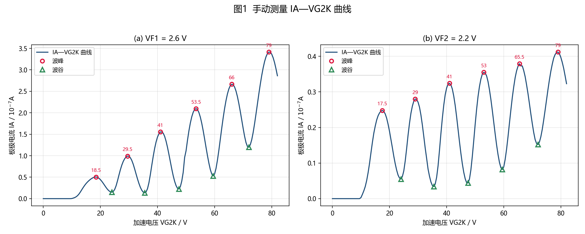
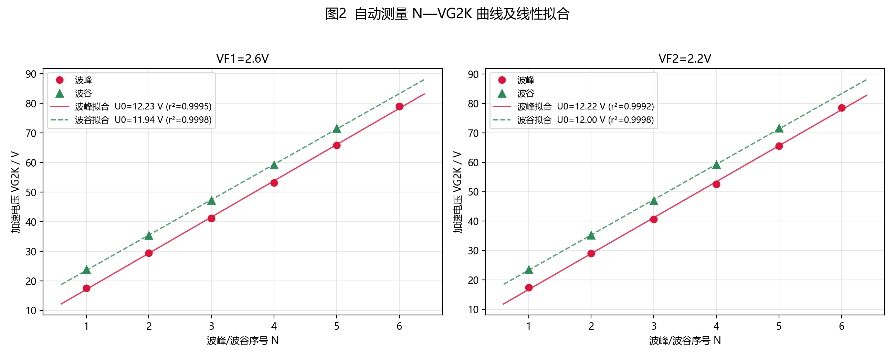
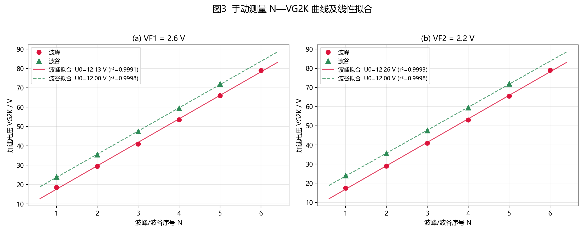

# 弗兰克-赫兹实验

> 本文件为实验报告中 **[数据记录与分析]** 与 **[思考题]** 两部分内容。
> 原始数据见 `data.xlsx`；作图与拟合由 `fh_analysis.py` 完成，图片为 `fig1_manual_IA_VG2K.png`、`fig2_auto_N_VG2K.png`、`fig3_manual_N_VG2K.png`。
> 电压表最大允许误差 0.01 V，按均匀分布取 B 类不确定度 $u_B=\dfrac{0.01}{\sqrt{3}}\approx 0.0058\ \mathrm{V}$。

---

## [数据记录与分析]

### 1. 手动测量

#### （1）实验条件

| 条件 | 灯丝电压 $V_F$ /V | 第一栅压 $V_{G1K}$ /V | 拒斥电压 $V_{G2A}$ /V |
|:--|:--:|:--:|:--:|
| 手动测量 1 | 2.6 | 1.5 | 8 |
| 手动测量 2 | 2.2 | 1.5 | 8 |

即 $V_{F1}=2.6\ \mathrm{V}$，$V_{G1K}=1.5\ \mathrm{V}$，$V_{G2A}=8\ \mathrm{V}$；$V_{F2}=2.2\ \mathrm{V}$，$V_{G1K}=1.5\ \mathrm{V}$，$V_{G2A}=8\ \mathrm{V}$。

#### （2）原始数据

加速电压 $V_{G2K}$ 由 0 逐增至 82 V（间隔 0.5 V），同步记录板极电流 $I_A$（单位 $10^{-7}\mathrm{A}$）。两组灯丝电压下的数据列于表 1。

> 说明：$V_{G2K}<10\ \mathrm{V}$ 时 $I_A$ 为 0（电子动能尚未能克服拒斥电压 $V_{G2A}$ 到达板极），故前若干行读数均为 0。

**表 1 手动测量原始数据（$V_{G2K}$—$I_A$）**

| $V_{G2K}$/V | $I_A/10^{-7}$A (VF1=2.6V) | $I_A/10^{-7}$A (VF2=2.2V) |
|---:|---:|---:|
| 0 | 0 | 0 |
| 0.5 | 0 | 0 |
| 1 | 0 | 0 |
| 1.5 | 0 | 0 |
| 2 | 0 | 0 |
| 2.5 | 0 | 0 |
| 3 | 0 | 0 |
| 3.5 | 0 | 0 |
| 4 | 0 | 0 |
| 4.5 | 0 | 0 |
| 5 | 0 | 0 |
| 5.5 | 0 | 0 |
| 6 | 0 | 0 |
| 6.5 | 0 | 0 |
| 7 | 0 | 0 |
| 7.5 | 0 | 0 |
| 8 | 0 | 0 |
| 8.5 | 0 | 0 |
| 9 | 0 | 0 |
| 9.5 | 0 | 0 |
| 10 | 0.003 | 0.003 |
| 10.5 | 0.013 | 0.012 |
| 11 | 0.025 | 0.022 |
| 11.5 | 0.043 | 0.034 |
| 12 | 0.07 | 0.051 |
| 12.5 | 0.108 | 0.073 |
| 13 | 0.156 | 0.099 |
| 13.5 | 0.21 | 0.129 |
| 14 | 0.262 | 0.158 |
| 14.5 | 0.31 | 0.184 |
| 15 | 0.353 | 0.204 |
| 15.5 | 0.389 | 0.221 |
| 16 | 0.421 | 0.233 |
| 16.5 | 0.449 | 0.241 |
| 17 | 0.472 | 0.246 |
| 17.5 | 0.49 | 0.248 |
| 18 | 0.501 | 0.245 |
| 18.5 | 0.504 | 0.238 |
| 19 | 0.495 | 0.226 |
| 19.5 | 0.474 | 0.209 |
| 20 | 0.443 | 0.189 |
| 20.5 | 0.403 | 0.166 |
| 21 | 0.357 | 0.143 |
| 21.5 | 0.308 | 0.119 |
| 22 | 0.259 | 0.098 |
| 22.5 | 0.216 | 0.08 |
| 23 | 0.182 | 0.066 |
| 23.5 | 0.159 | 0.058 |
| 24 | 0.151 | 0.055 |
| 24.5 | 0.166 | 0.062 |
| 25 | 0.214 | 0.078 |
| 25.5 | 0.3 | 0.106 |
| 26 | 0.418 | 0.141 |
| 26.5 | 0.549 | 0.179 |
| 27 | 0.674 | 0.212 |
| 27.5 | 0.781 | 0.24 |
| 28 | 0.867 | 0.26 |
| 28.5 | 0.93 | 0.274 |
| 29 | 0.972 | 0.28 |
| 29.5 | 0.992 | 0.279 |
| 30 | 0.986 | 0.271 |
| 30.5 | 0.953 | 0.257 |
| 31 | 0.89 | 0.235 |
| 31.5 | 0.801 | 0.207 |
| 32 | 0.691 | 0.175 |
| 32.5 | 0.573 | 0.142 |
| 33 | 0.458 | 0.113 |
| 33.5 | 0.353 | 0.083 |
| 34 | 0.263 | 0.063 |
| 34.5 | 0.195 | 0.047 |
| 35 | 0.152 | 0.037 |
| 35.5 | 0.136 | 0.034 |
| 36 | 0.157 | 0.041 |
| 36.5 | 0.232 | 0.06 |
| 37 | 0.371 | 0.092 |
| 37.5 | 0.563 | 0.136 |
| 38 | 0.778 | 0.183 |
| 38.5 | 0.985 | 0.226 |
| 39 | 1.17 | 0.263 |
| 39.5 | 1.32 | 0.292 |
| 40 | 1.435 | 0.311 |
| 40.5 | 1.512 | 0.322 |
| 41 | 1.554 | 0.324 |
| 41.5 | 1.552 | 0.32 |
| 42 | 1.525 | 0.308 |
| 42.5 | 1.451 | 0.288 |
| 43 | 1.339 | 0.262 |
| 43.5 | 1.196 | 0.23 |
| 44 | 1.032 | 0.195 |
| 44.5 | 0.86 | 0.16 |
| 45 | 0.69 | 0.127 |
| 45.5 | 0.534 | 0.098 |
| 46 | 0.403 | 0.074 |
| 46.5 | 0.304 | 0.056 |
| 47 | 0.241 | 0.045 |
| 47.5 | 0.227 | 0.044 |
| 48 | 0.278 | 0.055 |
| 48.5 | 0.409 | 0.081 |
| 49 | 0.612 | 0.119 |
| 49.5 | 0.959 | 0.163 |
| 50 | 1.114 | 0.209 |
| 50.5 | 1.359 | 0.251 |
| 51 | 1.578 | 0.287 |
| 51.5 | 1.761 | 0.315 |
| 52 | 1.907 | 0.336 |
| 52.5 | 2.012 | 0.35 |
| 53 | 2.076 | 0.355 |
| 53.5 | 2.097 | 0.353 |
| 54 | 2.074 | 0.345 |
| 54.5 | 2.007 | 0.329 |
| 55 | 1.899 | 0.306 |
| 55.5 | 1.755 | 0.279 |
| 56 | 1.583 | 0.248 |
| 56.5 | 1.391 | 0.215 |
| 57 | 1.193 | 0.182 |
| 57.5 | 1.001 | 0.151 |
| 58 | 0.827 | 0.124 |
| 58.5 | 0.678 | 0.102 |
| 59 | 0.573 | 0.087 |
| 59.5 | 0.531 | 0.082 |
| 60 | 0.575 | 0.089 |
| 60.5 | 0.705 | 0.11 |
| 61 | 0.899 | 0.139 |
| 61.5 | 1.131 | 0.174 |
| 62 | 1.384 | 0.212 |
| 62.5 | 1.641 | 0.249 |
| 63 | 1.882 | 0.284 |
| 63.5 | 2.1 | 0.314 |
| 64 | 2.287 | 0.34 |
| 64.5 | 2.441 | 0.359 |
| 65 | 2.557 | 0.372 |
| 65.5 | 2.632 | 0.379 |
| 66 | 2.665 | 0.373 |
| 66.5 | 2.654 | 0.373 |
| 67 | 2.6 | 0.36 |
| 67.5 | 2.505 | 0.343 |
| 68 | 2.374 | 0.32 |
| 68.5 | 2.212 | 0.295 |
| 69 | 2.029 | 0.267 |
| 69.5 | 1.834 | 0.238 |
| 70 | 1.637 | 0.211 |
| 70.5 | 1.453 | 0.186 |
| 71 | 1.305 | 0.166 |
| 71.5 | 1.215 | 0.155 |
| 72 | 1.199 | 0.152 |
| 72.5 | 1.255 | 0.159 |
| 73 | 1.371 | 0.174 |
| 73.5 | 1.54 | 0.195 |
| 74 | 1.746 | 0.221 |
| 74.5 | 1.973 | 0.249 |
| 75 | 2.209 | 0.278 |
| 75.5 | 2.443 | 0.307 |
| 76 | 2.664 | 0.334 |
| 76.5 | 2.867 | 0.358 |
| 77 | 3.044 | 0.378 |
| 77.5 | 3.192 | 0.395 |
| 78 | 3.304 | 0.405 |
| 78.5 | 3.379 | 0.411 |
| 79 | 3.415 | 0.412 |
| 79.5 | 3.411 | 0.407 |
| 80 | 3.366 | 0.397 |
| 80.5 | 3.283 | 0.383 |
| 81 | 3.168 | 0.366 |
| 81.5 | 3.024 | 0.345 |
| 82 | 2.862 | 0.323 |

#### （3）$I_A$—$V_{G2K}$ 曲线

以 $V_{G2K}$ 为横坐标、$I_A$ 为纵坐标作图（图 1），并标出曲线上的各波峰与波谷位置。

> **图 1　手动测量 $I_A$—$V_{G2K}$ 曲线**（(a) $V_{F1}=2.6$ V；(b) $V_{F2}=2.2$ V；红圈为波峰，绿三角为波谷）

由曲线读出各峰、谷对应的 $V_{G2K}$ 与 $I_A$，列于表 2。

**表 2 手动测量峰、谷位置**

| 峰/谷 | 手动1 (VF1=2.6 V) $V_{G2K}$/V | $I_A/10^{-7}$A | 手动2 (VF2=2.2 V) $V_{G2K}$/V | $I_A/10^{-7}$A |
|:--|:--:|:--:|:--:|:--:|
| 波峰 1 | 18.5 | 0.504 | 17.5 | 0.248 |
| 波峰 2 | 29.5 | 0.992 | 29.0 | 0.280 |
| 波峰 3 | 41.0 | 1.554 | 41.0 | 0.324 |
| 波峰 4 | 53.5 | 2.097 | 53.0 | 0.355 |
| 波峰 5 | 66.0 | 2.665 | 65.5 | 0.379 |
| 波峰 6 | 79.0 | 3.415 | 79.0 | 0.412 |
| 波谷 1 | 24.0 | 0.151 | 24.0 | 0.055 |
| 波谷 2 | 35.5 | 0.136 | 35.5 | 0.034 |
| 波谷 3 | 47.5 | 0.227 | 47.5 | 0.044 |
| 波谷 4 | 59.5 | 0.531 | 59.5 | 0.082 |
| 波谷 5 | 72.0 | 1.199 | 72.0 | 0.152 |

#### （4）由峰点求氩原子第一激发电位

**方法一（逐差法／相邻峰间距）**

相邻两波峰的电压差 $\Delta V_{G2K}$ 即为一个周期，等于第一激发电位 $U_0$：

- 手动1 ($V_{F1}=2.6$ V)：$11.0,\ 11.5,\ 12.5,\ 12.5,\ 13.0$ V，平均 $U_0=12.10$ V（标准差 0.82 V）
- 手动2 ($V_{F2}=2.2$ V)：$11.5,\ 12.0,\ 12.0,\ 12.5,\ 13.5$ V，平均 $U_0=12.30$ V（标准差 0.76 V）

**方法二（$N$—$V_{G2K}$ 线性拟合）**

以波峰序号 $N(=1,2,\cdots,6)$ 为横坐标、$V_{G2K}$ 为纵坐标作直线拟合（图 3）。由弗兰克-赫兹实验规律 $V_{G2K}(N)=N\,U_0+V_c$（$V_c$ 为接触电势差），斜率即为第一激发电位 $U_0$。

**表 3 手动测量线性拟合结果**

| 数据 | 拟合直线 | 相关系数 $r$ | $U_0$/V | 接触电势 $V_c$/V |
|:--|:--|:--:|:--:|:--:|
| 手动1 波峰 | $V_{G2K}=12.129\,N+5.467$ | 0.99953 | **12.13** | 5.47 |
| 手动1 波谷 | $V_{G2K}=12.000\,N+11.700$ | 0.99990 | **12.00** | 11.70 |
| 手动2 波峰 | $V_{G2K}=12.257\,N+4.600$ | 0.99965 | **12.26** | 4.60 |
| 手动2 波谷 | $V_{G2K}=12.000\,N+11.700$ | 0.99990 | **12.00** | 11.70 |

#### （5）不确定度分析

**(a) 电压表引入的 B 类不确定度**

电压表最大允许误差 $\Delta=0.01\ \mathrm{V}$，按均匀分布：

$$u_B(V)=\frac{\Delta}{\sqrt{3}}=\frac{0.01}{1.732}=0.0058\ \mathrm{V}$$

**(b) 线性拟合斜率的不确定度**

斜率 $k=\dfrac{S_{xy}}{S_{xx}}$，其中 $S_{xx}=\sum(N_i-\bar N)^2$，$S_{xy}=\sum(N_i-\bar N)(V_i-\bar V)$。

- A 类（由拟合残差估计，反映曲线读数的散布）：
  $$u_A(k)=\frac{s}{\sqrt{S_{xx}}},\qquad s=\sqrt{\frac{\sum (V_i-\hat V_i)^2}{n-2}}$$
- B 类（电压表误差传递）：
  $$u_B(k)=\frac{u_B(V)}{\sqrt{S_{xx}}}=\frac{0.0058}{\sqrt{S_{xx}}}$$
- 合成：$u(k)=\sqrt{u_A^2+u_B^2}$

以手动1波峰为例：$n=6$，$S_{xx}=17.5$，$s=0.778\ \mathrm{V}$，
$u_A=0.778/\sqrt{17.5}=0.186\ \mathrm{V}$，$u_B=0.0058/\sqrt{17.5}=0.0014\ \mathrm{V}$，
$u(k)=0.186\ \mathrm{V}$。可见实测中 **A 类（读数散布）远大于 B 类（仪器误差）**，是主要不确定度来源。

**(c) 测量结果**

取上述四种拟合的平均：$U_0=(12.13+12.00+12.26+12.00)/4=12.10\ \mathrm{V}$，各拟合值标准差约 $0.13\ \mathrm{V}$，**相对不确定度约 1.1 %**。

> **手动测量结果：$U_0=12.10\pm0.13\ \mathrm{V}$**

---

### 2. 自动测量

#### （1）实验条件

$V_{G1K}=1.5\ \mathrm{V}$，$V_{G2A}=8\ \mathrm{V}$；加速电压 $V_{G2K}$ 由仪器自动扫描（扫描范围约 0～82 V），计算机自动判读峰、谷位置。分别在灯丝电压 $V_{F1}=2.6\ \mathrm{V}$ 与 $V_{F2}=2.2\ \mathrm{V}$ 下各测一组。

#### （2）波峰、波谷数据

**表 4 自动测量波峰数据**

| 序号 $N$ | VF1=2.6V $V_{G2K}$/V | $I_A/10^{-7}$A | VF2=2.2V $V_{G2K}$/V | $I_A/10^{-7}$A |
|:-:|--:|--:|--:|--:|
| 1 | 17.6 | 1.042 | 17.4 | 0.143 |
| 2 | 29.4 | 1.772 | 29.0 | 0.208 |
| 3 | 41.2 | 2.413 | 40.6 | 0.268 |
| 4 | 53.2 | 2.992 | 52.6 | 0.313 |
| 5 | 65.8 | 3.659 | 65.6 | 0.347 |
| 6 | 79.0 | 4.573 | 78.6 | 0.387 |

**表 5 自动测量波谷数据**

| 序号 $N$ | VF1=2.6V $V_{G2K}$/V | $I_A/10^{-7}$A | VF2=2.2V $V_{G2K}$/V | $I_A/10^{-7}$A |
|:-:|--:|--:|--:|--:|
| 1 | 23.8 | 0.252 | 23.6 | 0.040 |
| 2 | 35.4 | 0.201 | 35.2 | 0.028 |
| 3 | 47.2 | 0.311 | 47.0 | 0.038 |
| 4 | 59.2 | 0.739 | 59.2 | 0.073 |
| 5 | 71.6 | 1.653 | 71.6 | 0.140 |

#### （3）$N$—$V_{G2K}$ 曲线与线性拟合

以波峰（或波谷）序号 $N$ 为横坐标、对应电压 $V_{G2K}$ 为纵坐标作图并作最小二乘直线拟合，如图 2。

> **图 2　自动测量 $N$—$V_{G2K}$ 曲线及线性拟合**（(a) $V_{F1}=2.6$ V；(b) $V_{F2}=2.2$ V）

**表 6 自动测量线性拟合结果**

| 数据 | 拟合直线 | 相关系数 $r$ | $U_0$/V | $u(k)$/V |
|:--|:--|:--:|:--:|:--:|
| VF1=2.6 V 波峰 | $V_{G2K}=12.234\,N+4.880$ | 0.99974 | **12.23** | 0.14 |
| VF1=2.6 V 波谷 | $V_{G2K}=11.940\,N+11.620$ | 0.99992 | **11.94** | 0.09 |
| VF2=2.2 V 波峰 | $V_{G2K}=12.223\,N+4.520$ | 0.99962 | **12.22** | 0.17 |
| VF2=2.2 V 波谷 | $V_{G2K}=12.000\,N+11.320$ | 0.99990 | **12.00** | 0.10 |

由斜率得氩原子第一激发电位：

$$U_0=\bar k=\frac{12.234+11.940+12.223+12.000}{4}=12.10\ \mathrm{V}$$

各组拟合值的标准差约 $0.15\ \mathrm{V}$，**相对不确定度约 1.2 %**。

> **自动测量结果：$U_0=12.10\pm0.15\ \mathrm{V}$**

#### （4）自动扫描条件下的峰位漂移（补充说明）

观察相邻峰（谷）间距，可见其随序号 $N$ 单调增大：

- VF1：峰间距 $11.8,\ 11.8,\ 12.0,\ 12.6,\ 13.2$ V；谷间距 $11.6,\ 11.8,\ 12.0,\ 12.4$ V
- VF2：峰间距 $11.6,\ 11.6,\ 12.0,\ 13.0,\ 13.0$ V；谷间距 $11.6,\ 11.8,\ 12.2,\ 12.4$ V

即**前几个间距（约 11.6～11.8 V）最接近公认值，而后段间距明显偏大**，说明存在随电压（或随扫描时间）增大的系统误差，详见后文讨论。

> **附：手动数据亦作 $N$—$V_{G2K}$ 拟合，见图 3。**

---

### 3. 结果汇总与讨论

#### （1）结果汇总

| 方法 | $U_0$/V |
|:--|:--:|
| 手动测量（4 组拟合平均） | 12.10 ± 0.13 |
| 自动测量（4 组拟合平均） | 12.10 ± 0.15 |
| **全部 8 组拟合的总平均** | **12.10 ± 0.13** |

氩原子第一激发电位**公认值** $U_0\approx11.5\ \mathrm{V}$（更精确地，氩原子第一亚稳态与基态的能量差为 $11.55\ \mathrm{eV}$，第二亚稳态为 $11.72\ \mathrm{eV}$，实验中测得值通常落在 $11.5\sim11.8\ \mathrm{V}$ 之间）。

本实验测得 $U_0=12.10$ V，与公认值相差约 $0.55\ \mathrm{V}$，**相对偏差约 4.8 %**。

#### （2）误差来源分析

1. **系统误差（主要）**：各条曲线的相邻峰间距随电压升高而系统增大（$11.6\to13.2$ V），说明存在随 $V_{G2K}$ 增大的系统偏差，使后段峰位"外拉"，从而使整体斜率偏大。可能来源：
   - 加速电压表／分压器在高量程段存在非线性（增益误差）；
   - 扫描过程历时较长，管子发热使阴极发射、气压等状态缓慢漂移，后段峰位随时间后移；
   - 电子在栅极前经历多次非弹性碰撞的统计分布随电压变化。
   若仅取前两三个峰间距计算，$U_0\approx11.6\sim11.8$ V，与公认值符合较好，佐证了上述判断。
2. **接触电势差**：峰位满足 $V_{G2K}(N)=N U_0+V_c$，由拟合截距可得接触电势差 $V_c\approx4.5\sim5.5$ V（峰拟合），它是恒定偏移，不影响斜率（即不影响 $U_0$），但会使曲线整体右移。
3. **读数分辨力**：$V_{G2K}$ 间隔 0.5 V、峰位判读约 ±0.25 V；电压表 B 类不确定度 $0.0058$ V。二者相对拟合散布均为小量。
4. **空间电荷效应**：灯丝发射电子形成的空间电荷会改变栅极附近电位分布，使峰形畸变、峰位判读产生偏差，灯丝电压越高越明显。

#### （3）结论

采用手动与自动两种方式测量，以波峰／波谷序号 $N$ 对 $V_{G2K}$ 作最小二乘拟合，得氩原子第一激发电位

$$\boxed{U_0=12.10\pm0.13\ \mathrm{V}\quad(\text{相对不确定度约}1.1\%)}$$

实验曲线呈现清晰的、周期约 12 V 的周期性起伏，线性相关系数均优于 0.999，定量验证了**电子与原子碰撞时能量交换的量子化（分立能级）**这一核心结论；测得值与公认值 11.5 V 的偏差（约 4.8 %）主要来自随电压增大的系统误差。

---

## [思考题]

### 1. 在弗兰克-赫兹实验中，得到的 U-I 曲线为什么呈周期性变化？改变反向拒斥电压 $U_{G2A}$ 的大小，请观察曲线有什么变化，为什么？

**（1）U-I 曲线周期性变化的原因**

电子从阴极发出后，在加速电压 $V_{G2K}$ 作用下获得动能 $E_k=eV_{G2K}$。由于原子能级是**分立的**，电子与氩原子的碰撞有两种：

- **弹性碰撞**：当 $eV_{G2K}<E_1$（$E_1$ 为第一激发能）时，电子动能不足以激发原子，碰撞几乎不损失能量，电子动能随 $V_{G2K}$ 增大而增大，到达板极的电子数增多，$I_A$ 上升。
- **非弹性碰撞**：当 $eV_{G2K}$ 增大到 $E_1$ 时，电子可以在栅极 $G_2$ 附近把能量 $E_1$ 交给氩原子使其激发，自身动能几乎耗尽，无法克服拒斥电压 $V_{G2A}$ 到达板极，于是 $I_A$ 陡然下降——形成第一个"峰"及其后的**谷**。

此后电压继续升高，电子在到达栅极前的路程中重新积累动能，又能到达板极，$I_A$ 回升；当 $eV_{G2K}$ 再次达到 $2E_1$ 时，电子可在途中发生**两次**非弹性碰撞，能量再次被耗尽，$I_A$ 又一次下降。依此类推，每当 $V_{G2K}=nE_1$（$n=1,2,3,\cdots$）时就出现一次电流下降，故曲线呈现**周期为 $E_1/e$ 的周期性起伏**，相邻峰（谷）的电压间隔就等于第一激发电位 $U_0=E_1/e$。这正是原子能级量子化的直接实验证据。

> 补充：第一个峰不出现在恰好 $V_{G2K}=E_1/e$ 处，而略高一些，是因为电子在管内不同位置发生非弹性碰撞，只有在栅极附近碰撞的电子才会因失去动能而到达不了板极；同时存在接触电势差 $V_c$，使峰位整体右移 $V_c$。曲线满足 $V_{G2K}(N)=NU_0+V_c$。

**（2）改变反向拒斥电压 $U_{G2A}$ 时曲线的变化及原因**

$V_{G2A}$ 加在栅极 $G_2$ 与板极 $A$ 之间，是阻碍电子到达板极的减速电压；只有动能 $E_k>eV_{G2A}$ 的电子才能到达板极形成电流。

- **增大 $V_{G2A}$**：到达板极的动能阈值提高，能到达板极的电子减少，$I_A$ **整体减小、曲线整体下移**；同时由于谷处的电子恰是经过非弹性碰撞、动能很小的电子，受减速电场阻挡最明显，**谷值下降比峰值更快，峰谷差（起伏）变得更深更明显**。
- **减小 $V_{G2A}$**：阈值降低，$I_A$ **整体增大、曲线整体上移**；当 $V_{G2A}\to0$ 时，几乎所有电子(包括经非弹性碰撞后动能很小的电子)都能到达板极，谷被"填平"，**周期性起伏逐渐减弱甚至消失，曲线趋于单调上升**。
- **关键结论**：$V_{G2A}$ 只改变电流的大小和起伏的深浅（谷的深度），**并不改变峰、谷的位置**，因此不影响第一激发电位 $U_0$ 的测量值。它的作用是"筛选"能量足够大的电子，把能量损失的信息放大成电流的谷。

---

### 2. 改变灯丝电压对氩原子的第一激发电位的测量结果是否会产生影响？为什么？

**结论：在合理范围内改变灯丝电压，基本不影响第一激发电位的测量结果。**

**原因：**

1. **第一激发电位是原子的内禀属性**。它由氩原子基态与第一激发态之间的能级差决定（$E_1\approx11.55\ \mathrm{eV}$），只与原子结构有关，与灯丝电压（即阴极发射电子的多少）无关。因此峰（谷）的**位置**（相邻间距）不随灯丝电压改变。
2. **灯丝电压只改变电流的大小与曲线形状**。灯丝电压 $V_F$ 决定阴极温度，从而决定热发射电子的数量和初动能分布：
   - $V_F$ 升高 → 发射电子增多 → $I_A$ 整体增大，峰、谷电流都变大；
   - $V_F$ 降低 → 发射电子减少 → $I_A$ 减小，曲线起伏幅度变小。
3. **本实验数据也印证了这一点**：$V_{F1}=2.6$ V 与 $V_{F2}=2.2$ V 两组曲线的电流大小相差明显（2.6 V 的峰电流约为 2.2 V 的 10 倍），但峰、谷位置几乎相同，拟合得到的第一激发电位分别为 12.10 V 与 12.13 V，差别在不确定度范围内。
4. **但灯丝电压不能任意偏离最佳值**，否则会间接影响测量精度：
   - 太低 → 电流过小、起伏不明显，信噪比差，峰位难判读；
   - 太高 → 发射过强，出现明显的**空间电荷效应**，电子间相互作用使曲线畸变（谷电流抬高、峰变钝），可能引起峰位偏移，带来附加误差。

所以，**灯丝电压的选择只影响曲线的"清晰度"和电流大小，不改变激发电位的数值**；实验中应选择使曲线起伏清晰、又不产生明显空间电荷效应的合适灯丝电压。

---

### 3. 我们实验中使用的是氩原子，测得的曲线谷值电流并不为零，这是为什么？

理论上，当电子动能恰为 $E_1$ 时应在栅极附近全部发生非弹性碰撞、能量耗尽，$I_A$ 应降为零。实际谷电流不为零，主要有以下原因：

1. **碰撞的统计性质（最主要）**：非弹性碰撞的发生是有一定概率的。当 $eV_{G2K}$ 略高于 $E_1$ 时，只有**部分**电子发生非弹性碰撞；其余电子仍作弹性碰撞并保留足够动能越过拒斥电压到达板极，构成谷处的"本底电流"。
2. **碰撞位置不同**：只有在栅极 $G_2$ **附近**发生非弹性碰撞的电子，才因失去动能而来不及重新加速、无法到达板极；在远离栅极处碰撞的电子，在剩余路程中会被重新加速，仍能到达板极，从而贡献谷电流。
3. **电子的初始能量分布**：热发射电子具有不同的初动能，加上加速电场的作用，电子的能量有一定分布，总有一部分电子即使损失 $E_1$ 后仍能到达板极。
4. **拒斥电压 $V_{G2A}$ 不够大**：$V_{G2A}$ 是"筛选"电子的门槛。若 $V_{G2A}$ 偏小，减速电场不足以把经过非弹性碰撞的慢电子全部挡回，谷电流就抬高；$V_{G2A}$ 越大，谷越深、越接近零。本实验 $V_{G2A}=8$ V，虽能挡住大部分慢电子，但不能挡住全部。
5. **氩原子亚稳态的存在**：氩原子被激发到第一激发态后，会很快跃迁到寿命很长的**亚稳态**（寿命可达 $10^{-3}$ s，远长于一般激发态的 $10^{-8}$ s）。处于亚稳态的原子不能立即辐射光子回到基态，因而对电子能量损失过程的统计产生影响，使谷电流不为零。
6. **空间电荷效应**：灯丝发射的电子在栅极附近形成电子云，改变了局部电位分布，相当于给电子提供了附加能量，使部分电子可以"绕过"能量损失而到达板极。
7. **二次电子与杂散电流**：电子轰击栅极、板极产生的二次电子发射，以及阴极热发射、光电发射产生的杂散电子，也会形成附加电流，使谷值不为零。

综合以上因素，谷值电流不可能降为零，**谷电流越小只表示非弹性碰撞越充分、$V_{G2A}$ 选取越合适**，但它不影响峰（谷）**位置**的判读，因而不影响第一激发电位的测量。

---

**主要参考值**：氩原子第一激发电位（第一亚稳态）$E_1\approx11.55\ \mathrm{eV}$，第二亚稳态 $11.72\ \mathrm{eV}$，公认值常取 $\approx11.5\ \mathrm{V}$。
